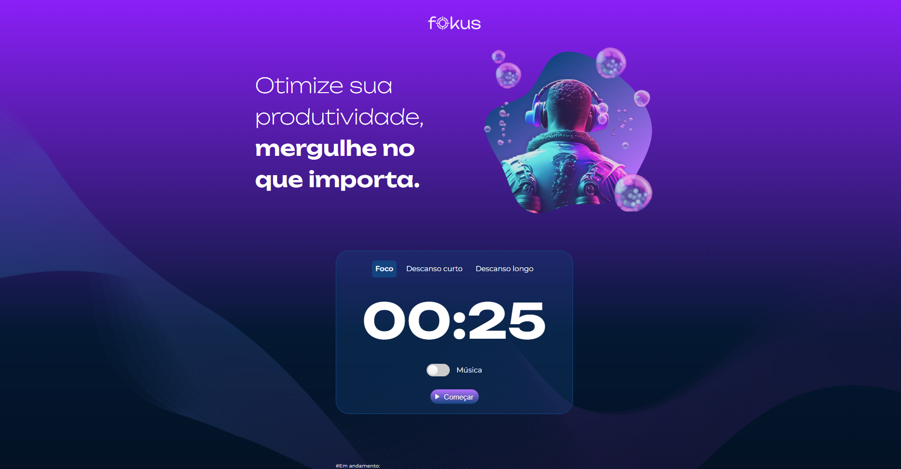

# Fokus

## ℹ️ Sobre

Projeto utilizado no curso para aprendizado das técnicas e melhores práticas.

## 📘Ementa

### TypeScript: o paradigma funcional no front-end

- Listar as principais funcionalidades do TypeScript, como a tipagem estática, genéricos e utilitários de tipo
- Explicar o conceito e a importância da programação funcional no contexto do TypeScript
- Implementar conceitos de programação funcional em um projeto TypeScript existente para melhorar a robustez e legibilidade do código
- Identificar seções de código que podem ser otimizadas por meio de técnicas de programação funcional em TypeScript
- Desenvolver novas funcionalidades para uma aplicação de média complexidade utilizando TypeScript e programação funcional
- Julguar a eficácia de diferentes abordagens de programação funcional em TypeScript em termos de eficiência e manutenção de código

## 🖥️ Tecnologias

  
  

## 🧑‍🏫 Instrutor(es)

| [ Vinicios Neves](https://github.com/viniciosneves) |
| :-------------------------------------------------------------------------------------------------------------------------------------------------------: |

## 💻 Screenshot

